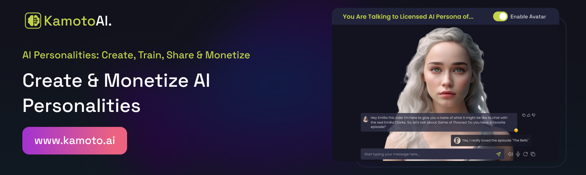

# Getting Started with Kamoto.AI's Character Demo Chat App

To interact with Kamoto.AI's character or personality through this Chat App, you will need the API Key and Personality ID obtained from the Kamoto.AI Character marketplace.

## What is Kamoto.AI?

[Kamoto.AI](Kamoto.AI) is a cutting-edge SaaS platform that empowers users to create, train, and monetize bespoke AI characters. It also offers celebrities and influencers the opportunity to license authentic AI replicas of themselves, fostering an innovative, interactive, and monetizable experience through our AI Marketplace and APIs. This digital persona opens new avenues for digital growth and uniqueness.

## What is this repository?

This repository contains a standard React app created using the `create-react-app` command to demonstrate how to use Kamoto.AI's API key to interact with an AI Character or Personality in your own application. You are free to use this sample app as a foundation for building your web or mobile application and seamlessly integrating the AI Character or Personality.

## How to install this repository?

1. Clone this repository to your local machine.
2. Navigate to the cloned repository using your terminal or command prompt.
3. Run `npm install` to install the necessary dependencies.
4. Once the installation is complete, execute `npm start` to launch the web app. It will open a new tab at URL `http://localhost:3000`, where you can start chatting with the AI character instantly.

## Learn More

For further information and in-depth details about Kamoto.AI, please visit our [Help Center](https://help.kamoto.ai). Here, you can explore various resources and gain valuable insights into leveraging the potential of AI Characters and Personalities for your unique applications.

## Kamoto.AI
Kamoto.AI is a SaaS platform that revolutionizes the way people interact with AI chatbots, celebrities, and influencers. Kamoto.AI provides an unprecedented opportunity for users to create and train their own virtual AI characters or digital clone. This not only allows for a uniquely customizable AI experience but also opens up a new avenue for monetization. Users can share these personalized AI characters with others on a rental basis, creating a dynamic marketplace of AI Persona

In a world that's increasingly fascinated by celebrity culture and influenced by social media personalities,Our product is limited only to creating digital clones but at the same time you can talk to your favorite AI character and personalities. Kamoto.AI takes it a step further. Celebrities and influencers can license their authorized AI personalities on their platform. These AI replicas are trained using structured data provided by the celebrities themselves, ensuring an authentic and truly representative AI version of their persona. This provides fans and followers with an exciting and intimate mode of interaction, never seen before.

Moreover, celebrities and influencers stand to benefit from this innovative model. Every usage of their licensed AI character generates a commission for them, thereby opening up a new and engaging revenue stream.

Kamoto.AI's capabilities don't just stop at individual users and celebrities. Kamoto.AI offers these AI personas as an API for seamless integration into other applications like telegram bots, mobile apps, etc. This opens up incredible possibilities for developers and companies who wish to offer their users the authentic experience of interacting with celebrities and influencers. Imagine a fitness app guided by your favorite athlete's AI, or a language learning app featuring your favorite author's AI - the possibilities are endless.

Kamoto.AI is on a mission to redefine the landscape of AI, celebrity culture, and social influence. By creating a symbiotic ecosystem of users, celebrities, influencers, and developers, Kamoto.AI is taking a leap into the future of digital interaction and monetization. Kamoto.AI is not just building an AI platform, it is creating a new digital universe where everyone can interact, innovate, and earn.  
